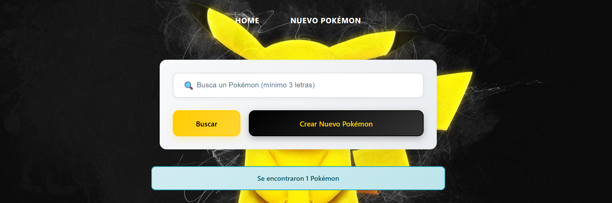

# 🎮 Ejercicio - PokeApp React Funcional

Aplicación mobile first y responsive para explorar y gestionar tu colección de Pokémon, desarrollada con React y Vite

## ✨ Características

- **🔍 Búsqueda de Pokémon**: Encuentra Pokémon por nombre con búsqueda en tiempo real
- **📱 Diseño mobile first y responsive**: Optimizada para móviles, tablets y desktop
- **🎨 Interfaz temática Pokémon**: Colores amarillos y azules inspirados en la franquicia
- **➕ Crear nuevos Pokémon**: Añade tus propios Pokémon personalizados a la colección
- **👀 Lista interactiva**: Visualiza todos los Pokémon con tarjetas detalladas
- **🔄 Gestión de estado**: Context API para manejo eficiente del estado global

## 🛠️ Tecnologías Utilizadas

- **React 18** - Biblioteca principal de UI
- **Vite** - Herramienta de build y desarrollo
- **React Router DOM** - Navegación entre páginas
- **Axios** - Cliente HTTP para peticiones a la PokeAPI
- **CSS3** - Estilos con enfoque mobile-first y responsive design
- **PokeAPI** - Datos completos de la Pokédex
- **Context API** - Gestión del estado global de la aplicación

## 🎯 Funcionalidades Principales

### Búsqueda Avanzada
- Búsqueda en tiempo real con debounce
- Filtrado por nombre con mínimo 3 caracteres
- Integración con PokeAPI y Pokémon personalizados

### Gestión de Pokémon
- Visualización en tarjetas con tipos, ID e imagen
- Creación de nuevos Pokémon personalizados
- Almacenamiento local en contexto React
- Navegación fluida entre lista y detalles

### Diseño Responsive
- Mobile-first approach
- Media queries para tablet y desktop
- Experiencia optimizada en todos los dispositivos
- Colores temáticos

## 🔗 Despliegue Netlify
https://ejercicio-pokeapp-react-funcional.netlify.app/
